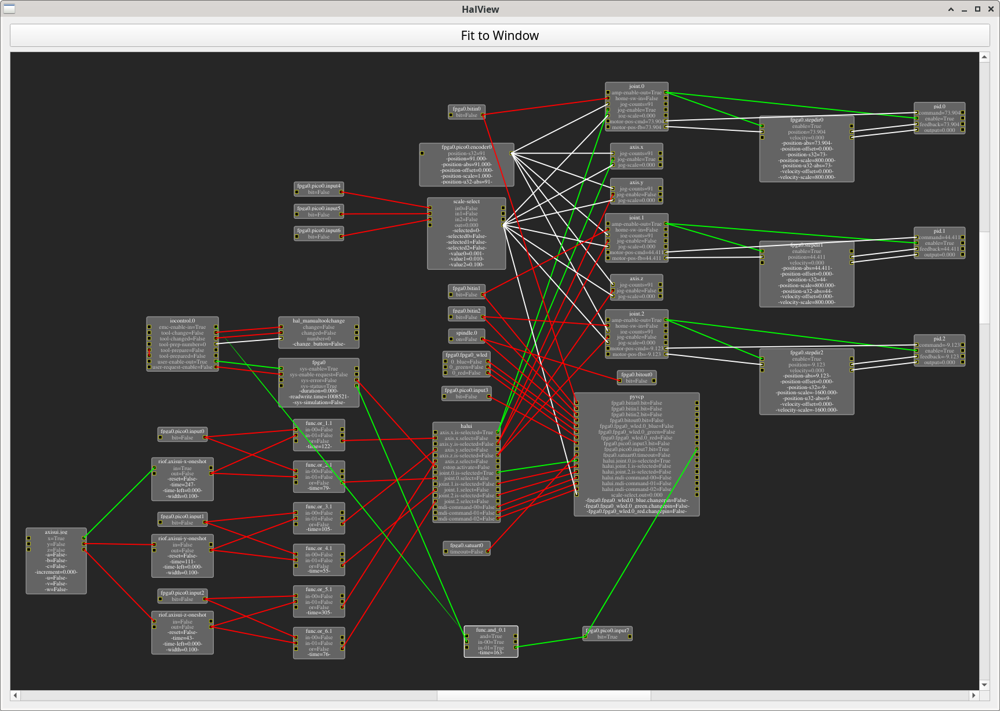

# halviewer

graphical halviewer for linuxcnc



## install depends
```
apt-get install python3-pyqt5 python3-graphviz
```

## before running halviewer, you need to run linuxcnc, than:
```
python3 halviewer.py
```


[](https://www.youtube.com/watch?v=Ma7J_gvicco&feature=youtu.be "HalViewer")
